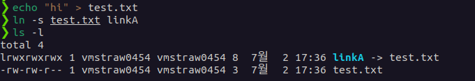

# 🌈 02. Symbloc Link
## 💡 Symbloc Link ?
1. **symbolic link 란?**

    - == soft link : 파일 경로를 가리키는 것으로, 원본 파일을 따로 복사하지 않고도 참조 가능
        
        ↔️ hard link : 동일한 파일 시스템 내에서만 작동, 원본파일과 동일한 inode 가지며 실제 파일내용을 공유
    - 링크를 연결하여 원본 파일을 직접 사용하는 것과 같은 효과를 내는 링크
    - 바로가기와 유사
    - 특정 폴더에 링크를 걸어 NAS, library 원본 파일을 사용하기 위해 사용
    
2. **symbolic link 사용법**

    *생성된 심볼릭 링크를 사용해 해당 원본 파일이나 디렉토리에 접근할 수 있다*

    ```
    ln -s [원본 파일/디렉토리] [링크 이름]   //생성 방법
    ```
    
    
    
    ```
    ls -l [링크 이름]   //symbolic link 읽기

    rm [링크 이름]  //삭제방법
    ```
    `-T` : 링크를 일반파일로 취급하는 옵션
    `-f` : 기존 심볼릭 링크가 있는 경우 덮어쓰는 옵션
    
    ```
    # /usr/bin/python3을 가리키는 /usr/local/bin/python 심볼릭 링크를 생성
    ln -s /usr/bin/python3 /usr/local/bin/python

    # 웹 서버의 DocumentRoot를 심볼릭 링크로 설정하는 예시
    ln -s /var/www/html /home/user/www

    # 자주 사용하는 프로젝트 디렉토리에 대한 심볼릭 링크 설정 예시
    ln -s /path/to/project /home/user/project

    # 백업 디렉토리에 대한 심볼릭 링크 설정 예시
    ln -s /backup/directory /home/user/backup

    # cat을 입력하면 ls가 실행되게 만들기
    # $(which ls)는 시스템에서 ls 명령어의 경로를 찾아줍니다
    ln -s $(which ls) /usr/local/bin/cat

    #readfile을 입력하면 cat이 실행되게 만들기
    ln -s $(which cat) /usr/local/bin/readfile
    ```

## 🔥 Challenge !
1. **`cat` 을 입력하면 `ls`가 실행되게 만들기**
    
    `ls -s $(which ls) ~/bin/cat`

2. **`readfile`을 입력하면 `cat`이 실행되게 만들기**

    `ls -s $(which cat) ~/bin/readfile`

안되면 이렇게 적용하기.

` export PATH=~/bin:$PATH`

`source ~/.bashrc`