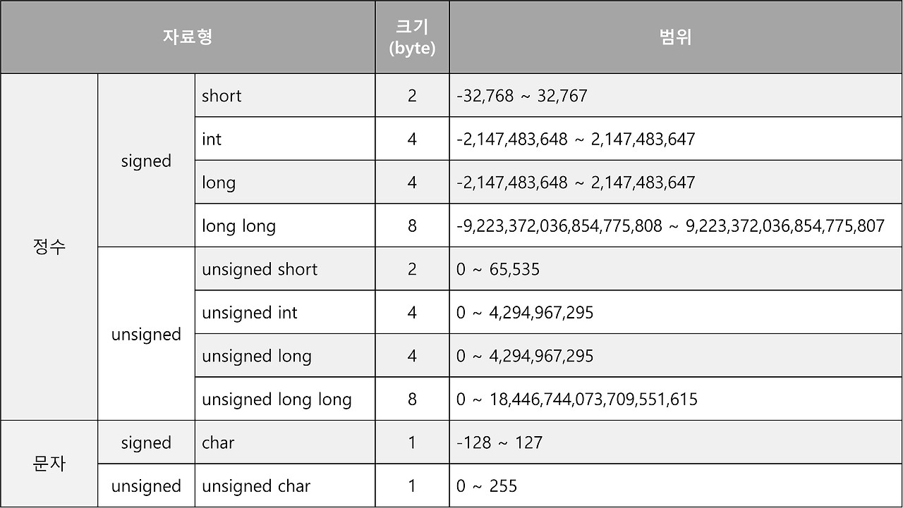
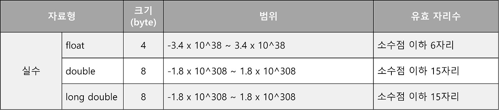

# ? 02. 자료형
>각 자료형의 크기와 범위를 알고, 적절하게 변수를 정의하고 사용하자
## ? 자료형 ?
1. **C언어의 상수와 변수**
- 상수 (const)
    - 프로그램이 실행되는 동안 값이 변하지 않는 데이터
    - 숫자 상수 : 정수 상수 & 실수 상수
    - 문자 상수 : 문자 상수('a') & 문자열 상수 ("대한민국")
    - 논리 상수 : 참(1) & 거짓(0)
- 변수 (variable)
    - 데이터를 저장하는데 사용되는 기억 장소 이름
    - 숫자 변수 : 정수형 변수 & 실수형 변수
    - 문자 변수 : 문자 변수 & 문자열 변수
변수에 상수값이 저장된다.
2. **C언어의 자료형**
- 자료형 (data type)
    - 프로그램에서 표현 , 저장하는 데이터의 종류 , 유형
    - 문자형 : char 
    - 정수형 : short, int, long
    - 부동소수형 : float, double, long double
    
    
3. **오버플로우와 언더플로우**
- 오버플로우 (overflow)
    - 값이 너무 커서 해당 변수의 최댓값을 넘어서면 최솟값이 나온다.
- 언더플로우 (underflow)
    - 값이 너무 작아서 해당 변수의 최솟값을 넘어서면 최댓값이 나온다.
4. **C언어의 변수 선언방법**
- `자료형 변수명 = 저장값`
- 변수 선언 이유: 자신이 쓸 변수에 해당되는 크기의 저장 공간을 할당 받기 위해
5. **변수 명명 규칙**
    1. 변수명의 첫 글자는 문자여야함
    2. 띄어쓰기 불가
    3. '@', '$' 제외 특수문자 사용불가
    4. 예약어 사용불가
        - 컴파일러가 사용하려고 예약 해놓은 단어들 (return class..)
    - 띄어쓰기 대안
        - 카멜 표기법 
            - `myVariableName`
            - 주로 변수명
        - 파스칼 표기법
            - `MyVaribaleName`
            - 주로 typedef, 클래스명, 함수명
        - 스네이커 표기법
            - `my_variable_name`
            - 주로 표준헤더, 라이브러리
        

6. **주석 사용 방법**
- `//` , `/* 주석 */`


## ? 코드 분석
```c
#include <stdio.h>
#define PI 3.14

int main(){
	int numOne = 1;
	int num_two = numOne; //두 변수의 명명규칙에는 어떤 차이가 있는가?
	float pi = PI;
	double int = 2.172; //가능한 코드인가?
	
	unsigned int big1 = 2147483649;
	int big2 = 2147483649;
	printf("%d %d\n", big1, big2); //어떤 결과가 출력되는가? 왜 이런 값이 출력되는가?

	long long int realbig = 9223372036854775807;
	printf("%lld\n", realbig);
}

//출력 결과
//-2147483649 -2147483647
//9223372036854775807
```
- #include <stdio.h>
    - <ins>전처리기 preprocessor 명령어 : 프로그램 코드를 컴파일 하기 전에 먼저 처리되는 기능.</ins>
- `#define PI 3.14`
    - 전처리기 명령어
    - 프로그램 내에서 PI가 모두 3.14로 치환되어 컴파일된다.
- `int numOne = 1` vs `int num_two = numOne`
    - int numOne = 1
        - 카멜표기법
        - 상수로 초기화
    - int num_two = numOne
        - 파스칼표기법
        - 변수로 초기화
- `double int = 2.172;` ?
    - 예약어(자료형이름)를 변수명으로 사용할 수 없음.
- `unsigned int big1 = 2147483649;` 와 `int big2 = 2147483649;`
    - unsigned int 범위가 0~ 2^32 -1 이므로, 2147483649 가 big1에 저장
    - int 범위가 -2^31 ~ 2^31 - 1 이므로, 2147483649 는 초과 범위로 오버플로 발생. -> 음수 저장
    - `%d`는 signed int 를 받으므로, big1, big2모두 overflow 발생값 출력
 - `long long int realbig = 9223372036854775807;`
    - long long int 범위가 -2^63 ~ 2^63 -1 이므로, 해당값이 유효한 값.
    - `%lld` 는 long long int를 그대로 출력할 수 있으므로, 값이 그대로 출력됨.
    
