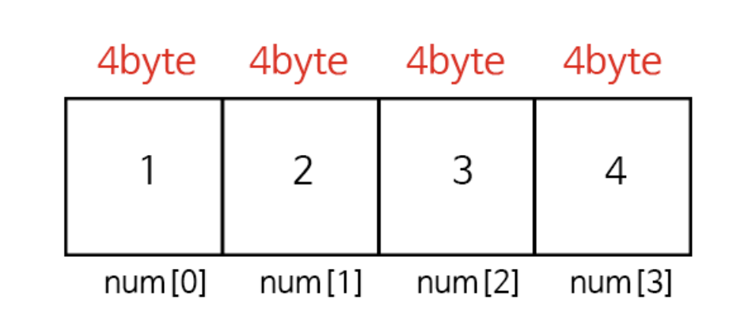
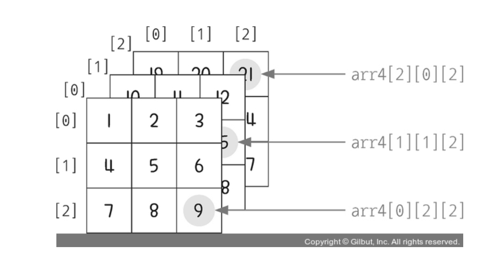

# ? 07. 배열
## ?C언어의 배열
1. **배열이란?**
- 어떤 한가지 자료형을 연속적으로 나열하는 것
2. **배열 선언 방법**
- `자료형 변수이름[갯수];`
```c
int a[5];
a={1,2,3,4,5}; //-----------X

int a[5]={1,2};  //---------O

int a[]={1,2,3};    //-----O

int a[];    //-------------X

int a=5;
int b[a];   //-------------X 변수를 배열크기로 지정할수없다
```
3. **배열의 인덱스 참조 방법, 배열의 메모리 구조**

- 배열명 자체는 배열[0]의 주소를 가리킨다.
- 인덱스 주소는 배열시작주소 + type크기 * 인덱스 로 구할 수 있다.
4. **2차원배열**
- `자료형 배열이름[열][행];`
```c
int numArr[3][4] = {
    { 가로 요소 4개 },
    { 가로 요소 4개 },
    { 가로 요소 4개 }
}; //       ↑ 세로 3줄
```
5. **n차원배열(n>2)**
- 3차원배열
    ```c
    int?arr[2][3][2]?=?{?
    ????????{????????????
                {1,?2},
                {3,?4},
                {5,?6}
    ????????},
    ????????{
    ????????????{7,?8},
                {9,?10},
                {11,?12}
    ????????}
    ????};
    ```

## ? 코드분석
```c
#include <stdio.h>

int main(){
	int nums1[10];
	int nums2[] = {11,12,13,14,15,16,17,18,19,20};

	printf("nums1 : ");
	for(int i=0;i<10;i++){
		nums1[i] = i;
		printf("%d ",nums1[i]);
	}
	printf("\n");
	
	int j=0;
	int nums3[10];
	while(j<10){
		nums3[j++] = nums1[j] + nums2[j];
	}

	printf("nums3 : ");
	for(int i=0;i<10;i++){
		printf("%d ",nums3[i]);
	}
	printf("\n");
}
```
1. nums1[10]로 10칸만들고 0으로 초기화한다.
2. nums1[0]~nums1[9]까지 0~9 값을 넣고 출력한다. => nums1 : 0 1 2 3 4 5 6 7 8 9
3. nums3[10]로 10칸 만들고 0으로 초기화한다.
4. nums3[i] 에 nums2[i]+nums1[i] 값을 넣고 i++해주며 각 nums[i]값을 출력한다. => nums3 : 11 13 15 17 19 21 23 25 27 29
```c
#include <stdio.h>

int main(){
	int arr[3][4] = {
		{1,2,3},
		{5,6,7,8},
		{9,10,11,12}
	};

	for(int i=0;i<3;i++){
		for(int j=0;j<4;j++)
			printf("%d ",arr[i][j]);
		printf("\n");
	}
}
```
1. 3열 4행 2차원 배열 arr을 만들고 초기화 한다.
2. arr[0][0] ~ arr[0][3] arr[1][0] ~ arr[1][3] ... 쭉 출력해준다.
```
1 2 3 0
5 6 7 8
9 10 11 12 예상출력결과
```
## ? Challenge !
1. **랜덤한 값을 가지는 10개의 배열 만들기**
2. **배열의 최댓값**
3. **해당 배열의 최솟값 출력하기**
4. **해당 배열을 오름차순으로 정렬하기**
5. **해당 배열을 내림차순으로 정렬하기**