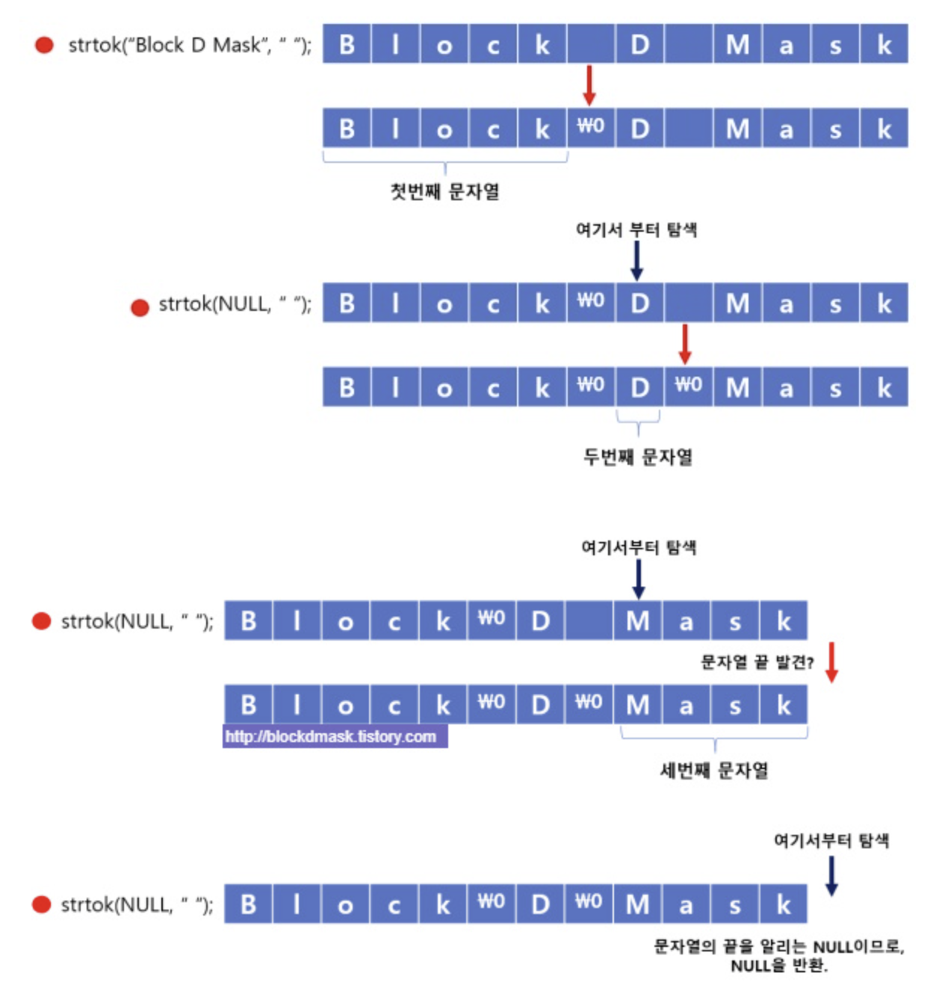

# 🌈 10. 문자열
## 💡 문자열?
1. **문자열의 개념과 용도**
- 문자열: 문자의 집합
    - 문자배열 or 포인터를 사용해 문자열을 다룸
    - 문자열의 마지막에는 NULL (\0)이 포함되어 문자의 끝을 나타냄
2. **문자열의 선언과 초기화**
- 문자배열을 사용한 선언과  초기화
    - 문자열을 저장할 공간을 메모리에 직접 할당하는 방식
    - `char str1[14] = "Hello World!";  //명시적 크기 선언과 초기화`
    - `char str2[] = "Hello World!";    //컴파일러가 크기를 계산하여 할당`
- 문자포인터를 사용한 선언과 초기화
    - 문자열 리터럴의 주소를 포인터 변수에 저장 (읽기전용으로 메모리 영역에 저장됨)
    - `char *str = "Hello World!";`
3. **문자열과 배열의 관계**
- 문자열은 char 배열에 저장이된다. 배열의 각요소는 문자열을 구성하는 각 문자이다.
- 인덱싱으로 문자하나하나에 접근할 수 있다.
- `char data[6] = "hello";`
    - {'h','e','l','l','o',0}
    - 문자 개수 5개, 배열의 크기는 6
4. **문자열과 포인터의 관계**
- 문자열은 문자배열을 가리키는 포인터. 
- 문자열을 가리키는 포인터를 사용하면 문자열을 함수에 전달하거나 함수에서 반환하는 등의 작업을 수행가능
- `char str[] = "hello";`
- `char* str = "hello";`
5. **문자열 관련 함수들**
> string.h 헤어파일에 선언되 문자열 관련 함수들.
- 문자열 길이
    - `strlen(str)` : <ins>NULL 제외 길이</ins>
- 문자열 복사
    - `strcpy(dest, src)` : src문자열을 dest로 복사
    - `strncpy(dest, src, n)` : src문자열의 처음 n개 문자열을 dest로 복사 (널도 알아서 넣어줘야함!)
- 문자열 연결
    - `strcat(dest, src)` : src문자열을 dest 문자열 끝에 연결
    - `strncat(dest, src, n)`   : strc문자열의 처음 n개 문자를 dest문자열 끝에 연결 (널 포함됐는지 확인하기 !)
- 문자열 비교
    - `strncmp(str1, str2)` : str1과 str2문자열을 비교. 같으면 0, str1>str2면 양수, str1<str2면 음수 반환
    - `strcmp(str1, str2, n)`   : str1과 str2문자열 처음 n개 문자 비교. 같으면 0, str1>str2면 양수, str1<str2면 음수 반환
- 문자열 검색
    - `strchr(str, c)` : str문자열에서 처음으로 c가 나타나는 위치 포인터 반환. 없으면 NULL 반환
    - `strrchr(str, c)`   : str문자열에서 마지막으로 c가 나타나는 위치의 포인터 반환
    - `strstr(str, needle)` : str문자열에서 needle 문자열이 시작하는 첫번째 위치의 포인터를 반환. 없으면 NULL 반환
- 문자열 출력함수
    - `sprintf()`   : 문자열에 출력을 한다.
        ```c
        #include <stdio.h>
        #include <string.h>

        void main(){
            char content[32] = "I am %s. My score is %d";
            char result[64] = {0,};

            sprintf(result,content,"Tory",100); //content에 tory와 100을 넣어 result에 출력한다.(넣는다)
            printf("result : %s\n",result);
        }
        ```
    - `snprintf()`

- 기타 함수
    - `strtok(str,"구분자")`    :구분기호 기준으로 문자열 토근 나누기
    ```c
    char str[] = "block D mask";
    char *ptr = strtok(str," ");    //  block\0D mask
    while (ptr != NULL){
        printf("%s\n",ptr);
        ptr = strtok(NULL," "); //  D\0mask
    }
    ```
    
    - `strlwr()`    : 소문자 변환
    - `strupr()`    : 대문자 변환
    - `strdup()`    : 문자열 복제

- 

## 📄 코드 분석
```c
// 다음과 같은 코드를 이해해봅시다.
#include <stdio.h>

void reverse(char* str) {
    int len = 0;
    while(str[len] != '\0') {
        len++;
    }

    for(int i=0; i<len/2; i++) {
        char temp = str[i];
        str[i] = str[len-i-1];
        str[len-i-1] = temp;
    }
}

int main() {
    char str[] = "Hello, World!";
    reverse(str);
    printf("%s\n", str);
    return 0;
}
```
- reverse 함수 인자로 문자열 배열의 주소를 전달한다. 
- len길이를 구해준다.(NULL 포함X)
- len/2만큼 돌며 문자열의 순서를 거꾸로 바꾼다.
- "!dlroW ,olleH" 가 출력될 것이다.

```c
// 아래의 코드의 실행 결과를 예상하여 봅시다
#include <stdio.h>
#include <string.h>

int find_char(char* str, char c) {
    for(int i=0; str[i] != '\0'; i++) {
        if(str[i] == c) {
            return i;
        }
    }
    return -1;
}

int main() {
    char str[] = "Hello, World!";
    char c = 'o';
    int pos = find_char(str, c);
    if(pos != -1) {
        printf("The character '%c' found at position %d\n", c, pos);
    } else {
        printf("The character '%c' not found\n", c);
    }
    return 0;
}
```

## 🔥 Challenge !!
