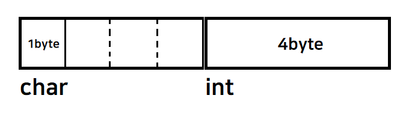

# 🌈 11. 구조체
## 💡 구조체?
1. **구조체의 개념과 용도**
- 구조체 
    - 하나 이상의 변수 (포인터 변수와 배열 포함)을 묶어서 새로운 자료형을 정의하는 도구
2. **구조체 선언과 초기화**
- 정의
    ```c
        struct person // person이라는 이름의 구조체 정의
    {
        char name[20]; // 이름 저장을 위한 멤버
        char phoneNum[20]; // 전화번호 저장을 위한 멤버
        int age; // 나이 저장을 위한 멤버
    }
    ```
- 선언
    ```c
    struct type_name val_name; // 구조체 변수선언의 기본 형태

    struct person man;
    ```
- 초기화
    ```c
    struct person man={"김허수", "010-1144-8844", 25};
    ```
    - 초기화 과정에선 문자열 저장을 위해 strcpy함수를 호출하지 않아도된다.
    - 대입할때는 strcpy를 통해 문자열을 저장해줘야한다..!!
3. **구조체와 배열, 포인터의 관계**
- 구조체 배열 선언
    ```c
    struct person arr[4];
    ```
- 구조체 포인터 선언
    ```c
    struct point pos={11,22};
    struct point * pptr = &pos; //포인터변수 pptr이 구조체변수 pos를 가리킴
    
    (*pptr).xpos=10;    //포인터변수 pptr을 이용해 다음과 같이 구조체 변수 pos에 접근
    pptr->ypos=20;  // *. 연산을 ->로 대체.

    ```

4. **구조체와 함수**
- 구조체는 함수의 인수, 반환값으로 사용가능
- <ins>call by value</ins> 적용. => 크기가 큰 구조체의 경우 포인터를 사용한다.
```c
//값을 함수로 넘기기
int equal(struct student s1, struct student s2){
    if (s1.number==s2.number) return 1;
}//equal(a,b)


//주소를 함수로 넘기기
int equal(struct student* s1, struct student* s2){
    if (s1.number==s2.number) return 1;
}//equal(&a,&b)

```
- 포인터를 통해 구조체를 변경시키는 것은 금지된다.

5. **구조체의 중첩과 typedef**
- 구조체 중첩
    - 구조체 안에 또다른 구조체를 멤버로 만들 수 있다.
    ```c
    #include <stdio.h>
    
    struct MyStruct1
    {
        char c;
        int i;
    };
    
    struct MyStruct2
    {
        char c;
        int i;
    };
    
    struct MyStructAll
    {
        char c;
        int i;
    
        // 중첩 구조체
        struct MyStruct1 ms1;
        struct MyStruct2 ms2;
    };
    
    int main(void) {
    
        struct MyStructAll ms;
        ms.c = 'A';
        ms.i = 10;
    
        ms.ms1.c = 'B';
        ms.ms1.i = 20;
    
        ms.ms2.c = 'C';
        ms.ms2.i = 30;
    }
    ```
- typedef
    - `typedef int ME`  //ME가 int대신에 사용된다
    - 다른 자료형의 별명을 만들기 위해 사용
    ```c
   // typedef와 구조체(1)
    struct Point{
        int x;		
        int y;		
    };	
    typedef struct Point Point;	// struct Point 대신에 Point를 사용한다는 의미

    // typedef와 구조체(2)
    typedef struct Point{
        int x;		
        int y;		
    }Point;		// struct Point 대신에 Point를 사용한다는 의미

    // typedef와 구조체(3)
    typedef struct{
        int x;		
        int y;		
    }Point;		// struct Point 대신에 Point를 사용한다는 의미

    // typedef와 구조체(4)
    struct Point{
        int x;		
        int y;		
    }typedef Point;		// struct Point 대신에 Point를 사용한다는 의미
    ```
6. **구조체의 메모리 구조와 패딩**

- 자료형의 크기가 가장 큰것의 배수주소에 변수가 할당된다.
- 빈공간을 패딩이라한다.


>구조체는 여러 개의 다른 자료형의 변수들을 하나의 이름으로 묶어서 관리할 수 있는 고급 자료형입니다.
>구조체를 이용하면 서로 다른 자료형의 데이터를 묶어서 하나의 덩어리로 처리할 수 있습니다.
>구조체는 간단한 변수와 배열, 포인터 등을 기반으로 복잡한 자료구조를 만들기 위한 기본적인 틀이자 도구입니다.

## 📄 코드 분석
```c
// 다음과 같은 코드를 이해해봅시다.
#include <stdio.h>

struct Student {
    char name[20];
    int score;
};

void print_student(struct Student* s) {
    printf("Name: %s, Score: %d\n", s->name, s->score);
}

int main() {
    struct Student s1 = {"Nogony", 90};
	print_student(&s1);
    return 0;
}

```
- Student 구조체를 정의한다.
    - char 배열 name과 score 멤버를 정의한다.
- s1 이라는 Student 구조체 자료형의 변수를 만들고 초기화를 해준다.
- 주소를 통해 s1을 보내고, s1의 이름, 점수를 출력한다.
```c
// 아래의 코드의 실행 결과를 예상하여 봅시다
#include <stdio.h>

struct Point {
    int x, y;
};

struct Point add_point(struct Point p1, struct Point p2) {
    struct Point result = {p1.x + p2.x, p1.y + p2.y};
    return result;
}

int main() {
    struct Point p1 = {1, 2};
    struct Point p2 = {3, 4};
    struct Point p3 = add_point(p1, p2);
    printf("(%d, %d)\n", p3.x, p3.y);
    return 0;
}

```
- Point p1, p2, p3 선언후 초기화
    - p3 은 add_point 함수를 이용하여 초기화
- p3.x 와 p3.y 출력결과로 (4,6)가 나옴.
```c
#define SIZE 200
struct Wc {
	char word[30];
	int count;
};

struct Wc simbol_table[SIZE];
int idx=0;

void count(input) {
    // 이곳을 완성
}

#define INPUT_SIZE 4
int main() {
	char buf[100];

	for (int i = 0; i < INPUT_SIZE; i++)
	{
		printf("단어를 입력하세요 : ");
		scanf("%s", buf);
		count(buf);
	}

	printf("\n[빈도수]\n");
	for (int i = 0; i < idx; i++)
	{
		printf("%s : %d\n", simbol_table[i].word, simbol_table[i].count);
	}
}

```
## 🔥 Challenge !!
1. **1번째 예시에서 1명이 아닌 5명의 학생 정보를 배열을 이용해 여러 학생의 정보를 출력 동작을 구현하기**
```c
#include <stdio.h>

struct Student {
    char name[20];
    int score;
};

void print_student(struct Student* s) {
    printf("Name: %s, Score: %d\n", s->name, s->score);
}

int main() {
    struct Student students[5];
    for (int i=0; i<5; i++){
        scanf("%s %d",&students[i].name,&students[i].score);
	    print_student(&students[i]);
    }
    return 0;
}
```
2. **2번째 예시에서 두 점의 좌표를 더하는 함수의 동작 원리 및 실행 결과 예상하기**
3. **3번째 예시에서 단어의 개수를 세는 count 함수 완성하기**
```c
#define SIZE 200
#include <string.h>
#include <stdio.h>
struct Wc {
	char word[30];
	int count;
};

struct Wc simbol_table[SIZE];
int idx=0;

void count(input) {
    // 이곳을 완성
    strcpy(simbol_table[idx].word,input);
    simbol_table[idx].count = strlen(input);
    idx++;
}

#define INPUT_SIZE 4
int main() {
	char buf[100];

	for (int i = 0; i < INPUT_SIZE; i++)
	{
		printf("단어를 입력하세요 : ");
		scanf("%s", buf);
		count(buf);
	}

	printf("\n[빈도수]\n");
	for (int i = 0; i < idx; i++)
	{
		printf("%s : %d\n", simbol_table[i].word, simbol_table[i].count);
	}
}
```
4. **구조체를 이용한 복소수 연산 함수 구현해보기 (덧셈, 뺄셈, 곱셈)**
```c
#include <stdio.h>

typedef struct Complex{
  int real;
  int imagin; 
}Complex;

Complex add(Complex a, Complex b){
    Complex Result = {a.real + b.real,a.imagin + b.imagin};
    return Result;
}

Complex sub(Complex a, Complex b){
    Complex Result = {a.real - b.real,a.imagin - b.imagin};
    return Result;
}

Complex mul(Complex a, Complex b){
    Complex Result;
    if (a.imagin*b.imagin>0){
        Result.real = a.real*b.real - a.imagin*b.imagin;
    }
    else Result.real = a.real*b.real + a.imagin*b.imagin;
    Result.imagin = a.real*b.imagin + a.imagin*b.real;
    return Result;
}

int main(){

    Complex a = {1,1};
    Complex b = {2,2};
    Complex Result[3] = {add(a,b),sub(a,b),mul(a,b)};
    for (int i=0; i<3 ; i++){
        printf("%d+%di\n",Result[i].real,Result[i].imagin);
    }


}
```