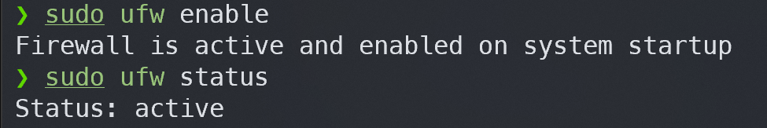
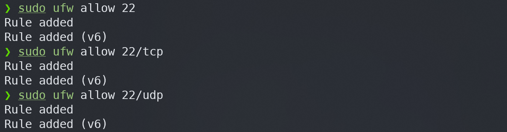
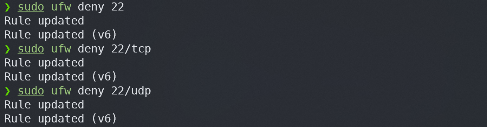
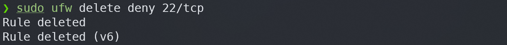
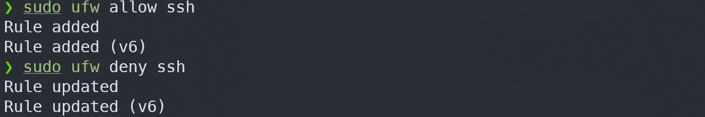
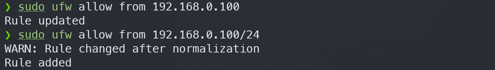
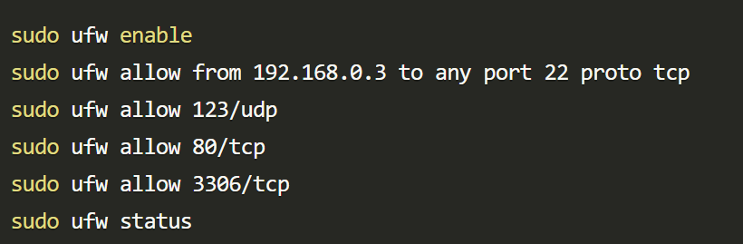

# 🌈 04. ufw
## 💡 방화벽과 리눅스 방화벽 시스템 UFW
1. **IP, PORT 이란?**
    - IP (Internet Protocol)
        - 컴퓨터 네트워크에서 통신에 사용되는 프로토콜
        - 네트워크에 연결된 각 기기를 식별하는데 사용
        - IPv4, IPv6
    - 포트 (Port)
        - 컴퓨터 내에서 특정 프로세스나 서비스를 식별하는데 사용
        - 네트워크 통신은 송신자와 수신자 간의 IP 주소 뿐 아니라 포트 번호도 포함하여 이루어짐
        - 0~ 65535 
            - well-known ports (0~1023)
            - registered ports (1024~49151) : 등록된 서비스가 할당
            - dynamic or private ports (49152 ~ 65535) 클라이언트 프로그램이 사용

2. **내부 IP, 외부 IP**
    - 내부 IP
        - 로컬 네트워크 내에서 사용되는 IP주소, 로컬 네트워크에 연결된 각 기기에 할당
        - 외부 네트워크 (인터넷) 에서는 직접적으로 접근 x
    - 외부 IP
        - 인터넷에 연결된 각 기기에 할당되는 고유 IP 주소
        - 인터넷 서비스 제공업체 ISP 에 의해 할당되며 공개적 접근가능
        - ISP에 따라 다를수 있음

    > 내부IP : 로컬 네트워크 내에서 통신에 사용, 외부IP : 인터넷 통신에 사용

3. **방화벽 (Firewall) 이란?**

    - 신뢰할 수 있는 내부 네트워크와 신뢰할 수 없는 외부 네트워크 간의 장벽을 구성 
    - 서로 다른 네트워크를 지나는 데이터를 허용 및 거부, 검열, 수정하는 소프트웨어 또는 그런 소프트웨어를 구동시키는 하드웨어 장치

        <ins>외부 사용자들이 내부네트워크에 접근하지 못하도록 내부 네트워크를 방어하기 위한 솔루션 !</ins>
    
        
    
    1. 1세대 : 패킷 필터링 방화벽
        - 미리 정해진 규칙에 따라 패킷의 출발지 및 목적지 <ins>IP 주소</ins> 정보와 각 서비스의 <ins>포트 번호</ins>를 이용하여 <ins>패킷단위</ins>로 접속 제어
    2. 2세대 : 스테이트풀 인스펙션 방화벽
        - <ins>세션을 맺은 패킷을 처리.</ins> 패킷 필터링 기술을 사용하여 패킷정보를 검토하고 <ins>TCP연결에 관한 정보를 기록</ins>하고 이를 토대로 패킷을 차단 / 허용.
    3. 3세대 : 애플리케이션 방화벽 (IPS, WAF, UTM)
        - 패킷 내용을 검사하고 TCP 데이터에서 각 애플리케이션 헤더를 확인하여 에플리케이션에 미치는 영향을 분석함.
    
4. **IP, PORT 확인 방법 (ifconfig, netstat)**
    ### ifconfig
    > install : `sudo apt install net-tools -y`
    - <ins>네트워크 인터페이스의 상태를 보여주고, 해당 인터페이스에 할당된 IP 주소를 확인하는데 사용</ins>
        
        ```cmd
        ifconfig [-a] [-v] [-s] <interface> [[<AF>] <address>]
        ```
        ifconfig으로 설정된 구성은 영구적이지 않음. 

        루트또는 sudo 권한이있어야 네트워크 인터페이스를 구성 할 수 있음.

        `ifconfig` : 모든 네트워크 인터페이스 및 관련 IP 주소의 구성 정보 표시
        `ifconfig -a` : 모든 활성 및 비활성 네트워크 인터페이스에 대한 정보 포함
        `ifconfig eth0` : 특정 네트워크 인터페이스의 구성정보를 표시
     
     - <ins>네트워크 인터페이스에 IP 주소 및 넷마스크 할당 가능</ins>
        ```cmd
        ifconfig [interface-name] [ip-address] netmask [subnet-mask]
        ```
        
        ```cmd
        ex)
            # 인터페이스 eth0에 IP주소 192.168.0.101 및 넷마스크 255.255.0.0을 할당하기
            ifconfig eth0 192.168.0.101 netmask 255.255.0.0

            # 인터페이스 별칭으로 네트워크 인터페이스에 보조 IP주소 할당하기
            ifconfig eth0:0 192.168.0.102 netmask 255.255.0.0
        ```
    - <ins>네트워크 인터페이스를 사용하거나 사용하지 않도록 설정</ins>

        네트워크 인터페이스를 재설정 해야할때
        ```cmd
        ex)
            # 활성 네트워크 인터페이스를 사용하지 않도록 설정
            ifconfig eth0 down  

            # 비활성 네트워크 인터페이스를 사용하도록 설정
            ifconfig eth0 up
        ```
    
    - <ins>네트워크 인터페이스의 MTU 주소 변경</ins>
        
        MTU 최대전송단위를 사용하면 인터페이스에서 전송되는 패킷의 크기를 제한 할 수 있다.
        ```cmd
        ifconfig [interface-name] mtu [mtu-value]
        ```
        ```cmd
        ex)
            # 네트워크 인터페이스의 MTU 값을 500으로 설정
            ifconfig eth0 mtu 500
        ```
    - <ins>네트워크 인터페이스의 MAC 주소 변경</ins>
        
        MAC 미디어 액세스 제어는 네트워크에서 장치를 고유하게 식별하는물리적 주소.
        ```cmd
        ex)
            ifconfig eth0 hw ether 00:00:2d:3a:2a:28
        ```

        ### netstat
        - 네트워크 연결 및 라우팅 테이블을 보여주는데 사용
        - 현재 시스템에서 수신 송신 되는 네트워크 연결의 상태와 포트를 확인하는데 유용
        - `-t` : TCP 연결 정보 표시
        - `-u` : UDP 연결 정보 표시
        - `-a` : 모든 연결 정보 표시
        - `-l` : 리스닝 상태인 소켓만 표시
        - `-n` : 숫자로 표시 (호스트이름을 숫자로 변환하지 않고 IP 주소 자체를 출력)

        ```cmd
        # 모든 연결 및 포트 확인
        netstat -tuln

        # 리스닝 상태인 TCP 포트 표시
        netstat -tln

        # 특정 프로토콜에 대한 연결 및 포트 확인 (TCP)
        netstat -tuln | grep "tcp"

        # 특정 포트를 사용하는 연결 확인 (Port 80)
        netstat -tuln | grep ":80"
        ```
5. **UFW 다운로드 및 사용 방법**
    
    UFW (Uncomplicated Firewall)

    - Ubuntu 리눅스 시스템에서 사용되는 간단한 방화벽 구성 툴
    - ufw에서 방화벽 규칙을 추가하면 IPv4와 IPv6 규칙을 자동으로 추가해줌
    - 네트워크 트래픽을 제어하고 방화벽 규칙을 설정 가능
    

        `sudo ufw enable` : 방화벽 활성화
        
        `sudo ufw disable` : 방화벽 비활성화
        
        

    - 기본룰 : 들어오는 패킷에 대해서는 전부 deny , 나가는 패킷에 대해서는 전부 allow

        `sudo ufw show raw` : 기본 룰 확인

        `sudo ufw default deny` : 기본 정책 차단

        `sudo ufw default allow` : 기본 정책 허용
    
    - UFW 허용 
        ```cmd
        sudo ufw allow <port>/<optional: protocal>
        ```
        

    - UFW 거부
        ```cmd
        sudo ufw deny <port>/<optional: protocol>
        ```
        
    
    - UFW 룰 삭제
        

    - service 명을 이용한 설정

        `less /etc/services` : 서비스명 보기
        ```cmd
        sudo ufw allow <service name>
        ```
        
    
    - 특정 IP 주소 허용/거부
        ```bash
        sudo ufw allow from <ip address>
        ```

        
    
    - 특정 IP 주소와 일치하는 포트 허용/거부
        ```cmd
        sudo ufw allow from <ip address> to <protocol> port <port number>
        ```
        
    - 특정 IP 주소와 프로토콜, 포트 허용/거부
        ```
        sudo ufw allow from <ip address> to <protocol> port <port number> proto <protocol name>
        ```
        

    추천 방화벽 정책
    

## 🔥 Challenge !
1. **모든 ip 접근을 막았을 때 변화**
    1. 외부로의 접근 제한
        - 외부 시스템에 SSH, HTTP, HTTPS 등과 같은 서비스에 접근할 수 없다.
        - 외부에서의 ICMP 패킷을 통한 ping과 같은 네트워크 도구를 사용하여 시스템에 대한 연결 상태를 확인할 수 없다.
    2. 로컬 서비스 접근에는 영향이 없다.
        - 로컬에서 실행중인 서비스에 영향없음. 시스템 내부에서 서비스에 접근 할 수 있다.
    3. 시스템 자체를 정상 작동
        - ufw 가 모든 외부 접근을 차단하는 것이지만, 시스템 자체는 정상 작동한다. 외부 서비스에 의존하지 않는 서버는 이런 설정을 적용할 수 있다.
    4. 외부에서의 공격이나 불법적 접근을 막을 수 있다.
2. **22번 포트 접근을 막았을 때 변화**
    
    22번포트는 SSH서비스에 사용되는 기본 포트

    1. SSH 접근 불가능
        - 외부에서 ssh 클라이언트를 사용하여 시스템에 접속 할 수 없다. ssh 클라이언트는 22번 포트를 통해 ssh 서버와 통신하므로 해당 포트에 대한 접근이 차단되면 원격으로 시스템에 접속 할 수 없다.
    2. 원격 관리 제한
        - ssh 를 사용하여 원격으로 시스템을 관리하던 경우, 해당 방법이 더이상 작동 하지않게된다. 원격으로 시스템에 접속하여 파일을 전송하거나 명령 실행 불가
    3. 공격자가 ssh를 통해 시스템에 액세스하는 시도를 차단
    4. 다른 포트 사용간으
        - ssh 서비스를 사용할 수 있도록 하려면 다른 포트를 사용하여 ssh 서비스를 구성해야함. 