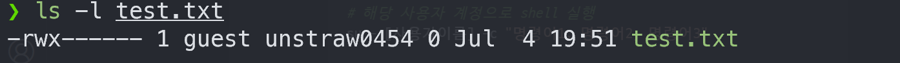

# 🌈 06. Permission of Linux
## 💡 리눅스 권한? 
1. **x,r,w의 뜻과 각각의 의미**
- x(execute) : 실행권한
- r(read) : 읽기 권한
- w(write) : 쓰기권한
2. **linux에서의 user**
- linux 시스템에서 사용자는 파일 및 리소스에 대한 액세스를 제어하는 주체
- 각 사용자는 고유한 이름을 가지며, 시스템 내부적으로는 사용자 ID (UID)로 식별된다.
- 사용자는 파일이나 프로세스를 소유하고, 파일 및 디렉터리에 대한 권한이 부여된다.
- 사용자 조회
    ```bash
    #모든 사용자 출력
    cat /etc/passwd

    #root 와 useradd, adduser로 생성한 사용자 출력
    grep /bin/bash /etc/passwd
    ```
- 사용자 추가
    ```bash
    # 사용자를 추가한다. (home dir와 paswd 설정) (권장)
    adduser newuser

    # 사용자 홈 디렉토리도 같이 만들고싶다면 -d옵션을 사용한다
    useradd newuser -d /home/newuser

    # 사용자의 비밀번호를 만든다
    passwd newuser
    ```
    - uesradd : 사용자 홈디렉토리 자동생성 X
    - adduser : 사용자 홈디렉토리 자동생성 O <- 권장**
- 사용자 수정
    ```bash
    # 사용자의 uid를 1001로 변경한다
    usermod -u 1001 newuser
    
    # /home/user-home을 생성하고 newuser사용자의 홈 디렉토리를 /home/user-home 으로 변경하고 파일 등을 이동한다.
    usermod -m -d /home/user-home newuser
    ```
- 사용자 삭제
    ```bash
    # 사용자 삭제
    userdel newuser

    # 사용자를 강제로 삭제한다
    userdel -f newuser
    userdel --force newuser

    # newuser사용자와 함꼐 사용자 디렉토리, 사용자 메일함도 삭제
    userdel -r newuser
    userdel --remove newuser
    ```
3. **linux에서의 group**
- 사용자의 집합을 나타내며, 이 그룹은 파일 및 디렉터리의 액세스 권한을 관리하는데 사용
- 각 그룹은 고유한 이름을 가지며, 시스템 내부적으로는 그룹ID(GID)로 식별된다.
- 사용자는 하나 이상의 그룹에 속할 수 있으며, 그룹에는 여러 사용자가 포함될 수 있다.
- 그룹 조회
    ```bash
    cat /etc/group
    ```
- 그룹 추가
    ```bash
    groupadd group2
    ```
- 그룹 사용자 추가
    ```bash
    addgroup user2 group2
    
    #사용자의 그룹조회
    groups user2
    ```
- 그룹 삭제
    ```bash
    groupdel group-1
    ```
- 그룹 권한 부여
    ```bash
    # admin에 대해 모두 접근할 수 있는 권한을 추가
    sudo nano /etc/sudoers
    ```
    

    ```bash
    # 사용자 권한 부여
    sudo nano /etc/sudoers
    ```
    
    이렇게 하기보다는.. 사용자를 그룹에 추가하고 그룹에 대한 권한을 부여하는 것을 권장

4. **chmod, chown 명령어**

    ### chmod 명령어
    - `chmod + 권한 [파일명]`
    
    - rwx rwx rwx

    - u    g   o   a (Owner Group Other All)

    ```bash
    ex) 
        chmod 777 file.py
        chmod u+rwx file.txt
        chmod g-w file.txt
        chmod o+x dir
        chmod 0744 file
    ```

    

    ### chown 명령어
    - change owner/group
    - 파일이나 디렉토리에 대한 권한을 변경하는 것과 별개의 작업. 소유자만을 변경하고 파일의 권한은 변경하지 않는다.
    - `chown [options] new_owner:group file(s)`
    ```bash
    ex)
        # 사용자 user1이 소유한 파일을 사용자 user2로 변경
        chown user2 filename
        
        # 그룹 group1에서 group2 로 소유자 그룹 변경
        chown :group2 filename
    ```
## 🔥 Challenge !
1. **knockon이라는 user생성**
    ```bash
        sudo adduser [사용자이름]

        #사용자 조회
        cat /etc/passwd
    ```
2. **knockon이라는 user의 shell로 접속**
    ```bash
    # 해당 사용자 계정으로 shell 실행 
    su - [사용자이름] -c "명령어1; 명령어2; 명령어3"
    ```
    ```bash
    # 사용자 계정으로 접속
    sudo su - [사용자이름]
    ```
3. **guest에서는 접근이 가능하고, knockon유저에서는 접근할 수 없는 파일 작성**
    ```bash
    # 사용자 계정으로 파일 만들고 나가기
    touch [파일명]
    exit
    ```
    ```bash
    # 파일의 소유자를 guest로 변경
    sudo chown guest [파일명]
    
    # guest 사용자에게만 rwx 권한 부여
    sudo chown 700 [파일명]
    ```
    
[Bandit Wargame](https://overthewire.org/wargames/bandit/)