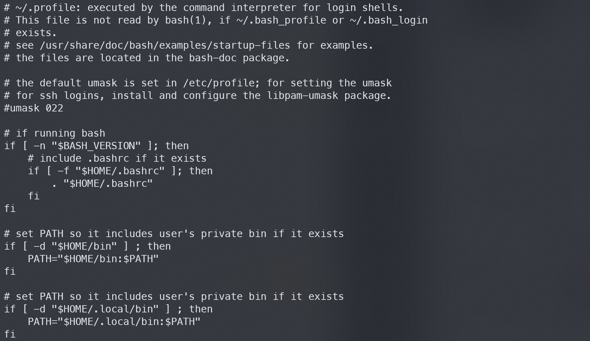
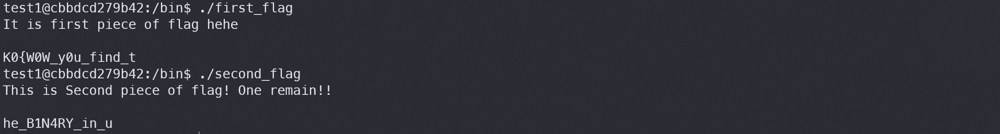
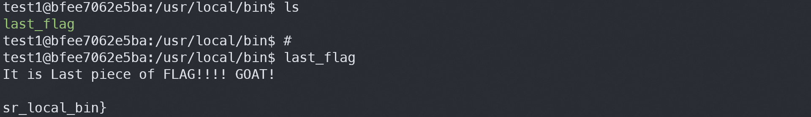
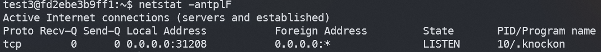
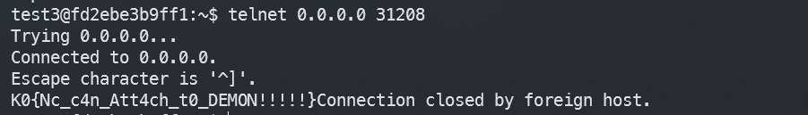

## 실습문제 0

`ls` 

## 실습문제 1

먼저 Hint 봤을때 Some **BINary** looks like print the FLAG..
There are Three Binaries. Can you find it? 라는데, 어쩌라고...

모르겠다... 아무리봐도 ..
cat .profile , .bash_logout, .bashrc 해봤다. 뭔가 주석으로 설명이되어있어서 보려고했는데 도무지 읽히지가않는다. 
문제에서 말하는 binary가 이 세 파일을 말하는건가 싶기도하다.

다시 보니까. .profile에  이런게 적혀있는데 힌트였던 것이다.

/bin/에 들어가보면 first_flag와 second_flag가 보인다.

그러면 마지막 flag는 어디에 있지? 생각해보니 .profile에 /local/bin도 적혀있어서 /usr/local/bin에 들어가보았다.

역시나 last_flag 발견. -> 해결.

## 실습문제 2

`ls -al`

## 실습문제 3
`netstat -antplF`

